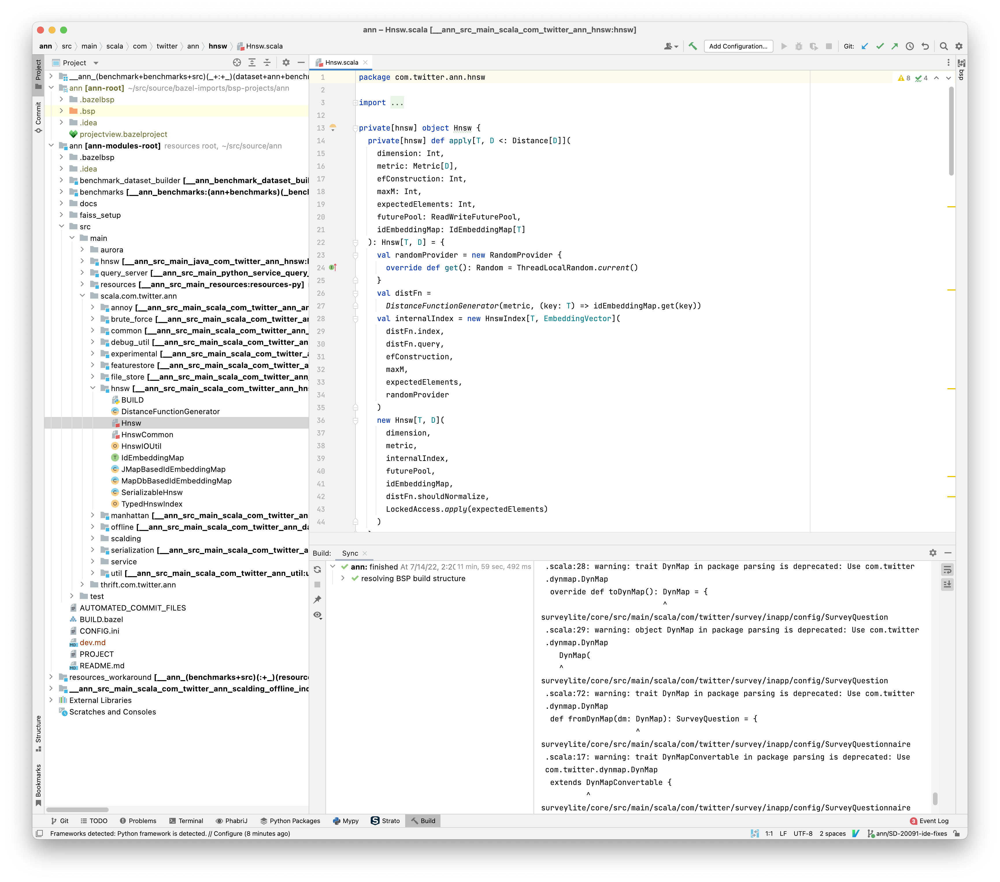

.. _dev:

Developer Guide
===============

.. tip::
  This document is intended for anyone digging into ANN, understanding the libraries or setting up a local environment.

💻 Setting up IntelliJ
----------------------

.. tip::

    See http://go/intellij for general IntelliJ instructions

All of `/ann` can be imported into IntelliJ as a single `BSP project <https://docbird.twitter.biz/intellij_at_twitter/Bazel_BSP_with_IntelliJ.html>`_ .

1. `$ ./bazel idea --bsp //ann/...`
2. In the popup that follows, select "BSP project"
3. Wait about 35 minutes for Bazel to build everything from scratch. If you have a recent local cache, this step should take only about 4m.
4. Once the build succeeds, everything should look like this. The sync process should be complete, and scala source files should have syntax highlighting and
   navigation working as expected. You should be able to run tests from the IntelliJ UI as well.

5. If you change any BUILD files, resync the project using The BSP panel on the top right side.

🧪 Running tests
----------------

.. tip::

    See `Testing Scala Applications and Libraries <https://docbird.twitter.biz/bazel_at_twitter/cookbook/jvm_cookbook/junit_tests.html?highlight=test%20junit>`_ for an overview.

1. IntelliJ UI should work fine for running tests individually or as a whole suite.
2. Run all the tests in a package with Bazel:

.. code-block:: bash

    $ alias bt='bazel test -t --test_output=all --test_summary=detailed'
    $ bt //ann/src/test/scala/com/twitter/ann/featurestore:featurestore

🏗 Building Indexes
-------------------

.. markdowninclude:: ../src/test/resources/service/query_server/hnsw/README.md

⛏ Scalding jobs
----------------

TODO:

1. Describe the workflow.
2. Migrate hadoop_binary to scalding_job
3. Link to scalding tool docs, add a working example. 
4. Add notes on binary size, tips to make it faster.

